# KartoTek User Guide

KartoTek is a suite of tools for scanning, importing, managing and
publishing a collection of postcards. It consists of four programs, used
in this order as you work:

| Tool | Role |
|---|---|
| **ktscan** | Scan postcards (front/back) with a scanner |
| **ktimport** | Check, correct and import the scans into the collection |
| **ktmanager** | Manage, enrich and publish the postcard collection |
| **kttools** | Command-line toolbox (maintenance, batch processing) |

> 📸 Each section indicates where to insert a screenshot (`` tags).
> The full list of screenshots to take is at the end of this document.

All the graphical tools share the same configuration file
(`postcards.conf`) and the same directories:

- **datadir**: directory where the collection's images and JSON records are stored
- **importdir**: holding directory for scans before they are imported
- **tmpdir**: temporary directory

---

## Contents

1. [ktscan — Scanning postcards](#1-ktscan--scanning-postcards)
2. [ktimport — Importing postcards](#2-ktimport--importing-postcards)
3. [ktmanager — Managing your postcards](#3-ktmanager--managing-your-postcards)
4. [kttools — Toolbox](#4-kttools--toolbox)

---

## 1. ktscan — Scanning postcards

`ktscan` is the batch-scanning application. It drives a scanner (SANE on
Linux, WIA/TWAIN on Windows) to scan the front and back of your postcards,
with a "batch" mode that triggers a scan at regular intervals (giving you
time to flip the next card on the scanner glass).

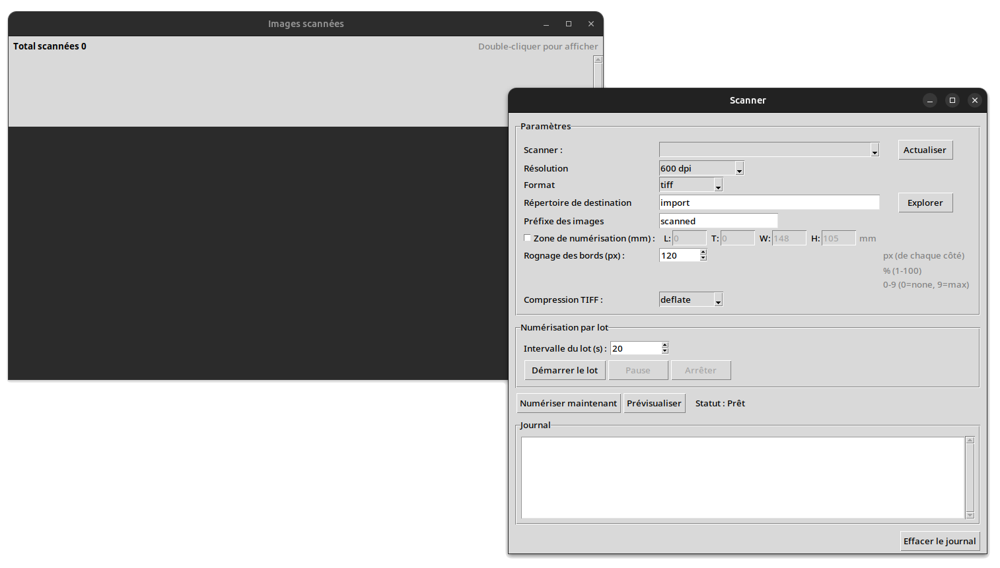

### 1.1 Startup

At launch, if the import directory (`importdir`) already contains files, a
window appears offering you the choice to:

- **Delete the files and continue**;
- **Continue and add files** (new scans will be added alongside them);
- **Quit**.

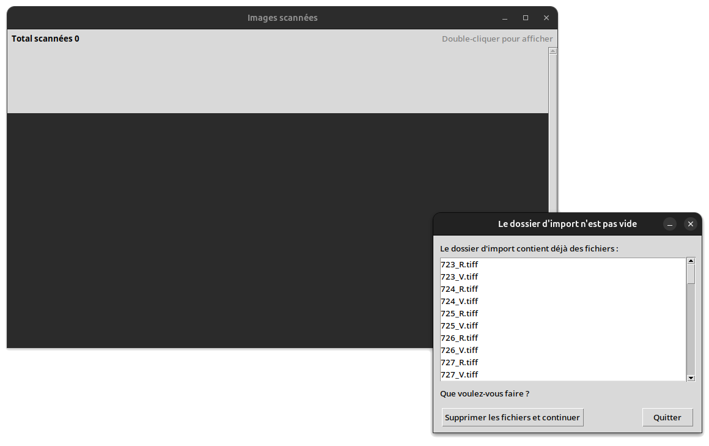

### 1.2 Scan settings

The **Settings** panel lets you configure:

- **Scanner**: the scanner selected from those detected (**Refresh Scanners** button to re-run detection);
- **Resolution**: 150 / 300 / 600 / 1200 dpi;
- **File format**: tiff, png or jpeg;
- **Destination folder** (**Browse** button);
- **File prefix**: prefix added to the name of scanned files;
- **Scan area (mm)**: coordinates and dimensions of the area to scan (useful for scanning only the postcard-sized area);
- **Border crop (px)**: number of pixels to remove from each side after scanning;
- **JPEG quality**, **PNG compression**, **TIFF compression**: compression settings depending on the chosen format.

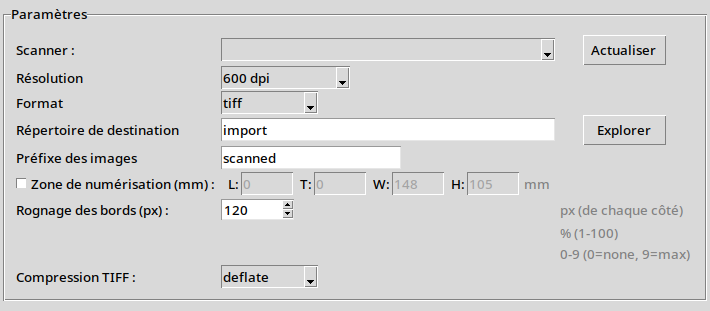

### 1.3 Batch scanning

The **Batch Mode** panel lets you set an **interval** (in seconds) between
two automatic scans, then:

- **Start Batch**: starts scanning in a loop. The button becomes
  "Scan Now" during the countdown, letting you scan immediately without
  waiting for the end of the interval;
- **Pause** / **Resume**: pauses or restarts the countdown;
- **Stop**: stops the batch.

The **Preview** button lets you run a test scan displayed in a separate
window, without saving anything to disk.

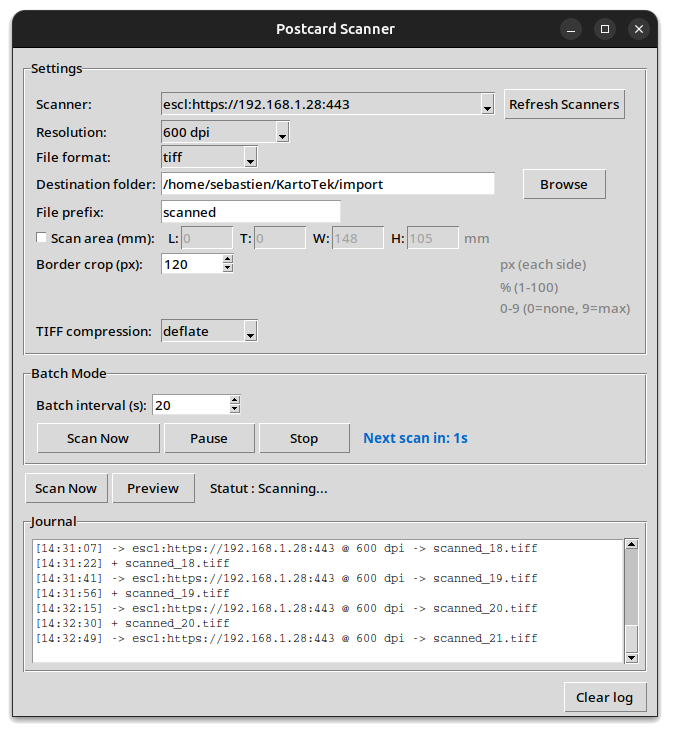

A **Log** at the bottom of the window records every action (scanning,
errors, pauses…), with a **Clear log** button.

### 1.4 Scanned images window

A separate "**Scanned Images**" window displays thumbnails of all the
postcards scanned during the session, with the total number scanned and a
double-click to enlarge an image.

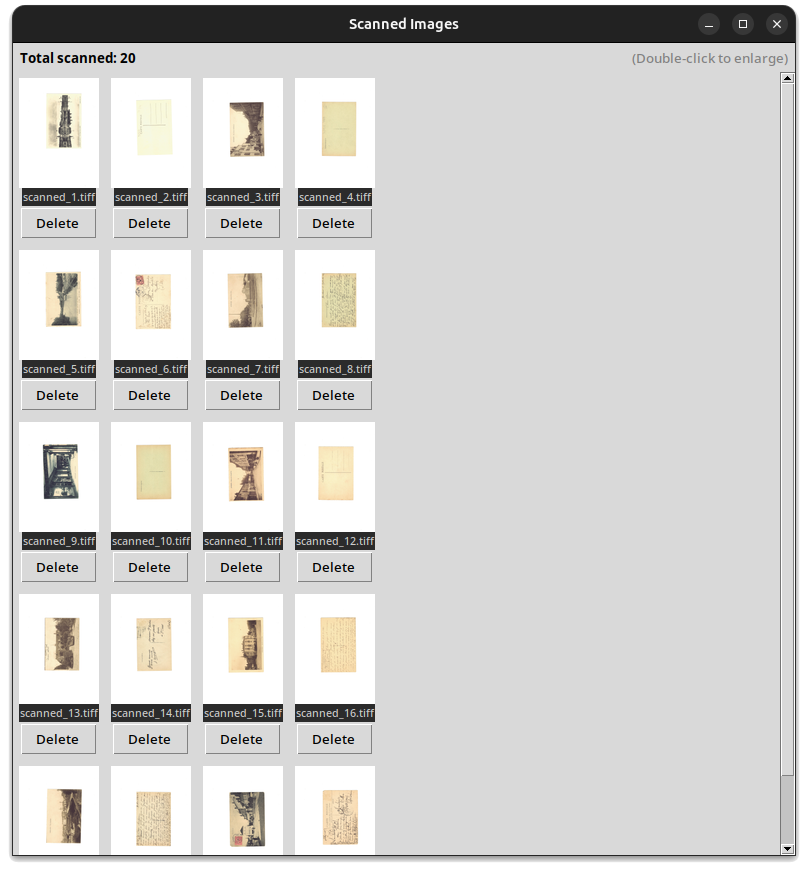

> ℹ️ If no scanner is detected, ktscan can run in simulated mode (a test
> image is generated), which is handy for training without hardware.

---

## 2. ktimport — Importing postcards

`ktimport` is the intermediate step between `ktscan` and `ktmanager`: it
is used to check, correct and validate scans before permanently adding
them to the collection. The work happens in three steps, displayed one
below the other in the window.

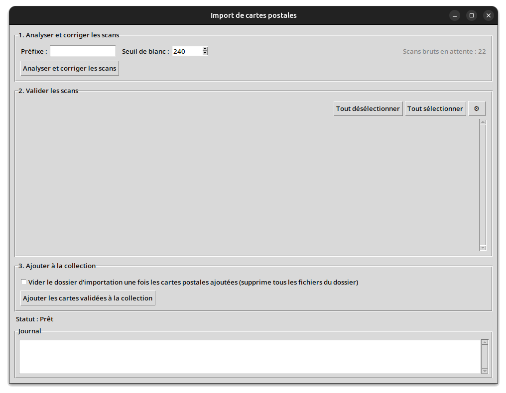

### 2.1 Step 1 — Analyze and correct scans

This step processes the raw scans present in the import directory:

- **Prefix**: filters the files to be processed by prefix;
- **White threshold**: threshold used to detect and correct the background of the scans;
- **Analyze and correct scans** button: starts processing (the number of
  scans waiting is displayed: "Raw scans waiting: N").

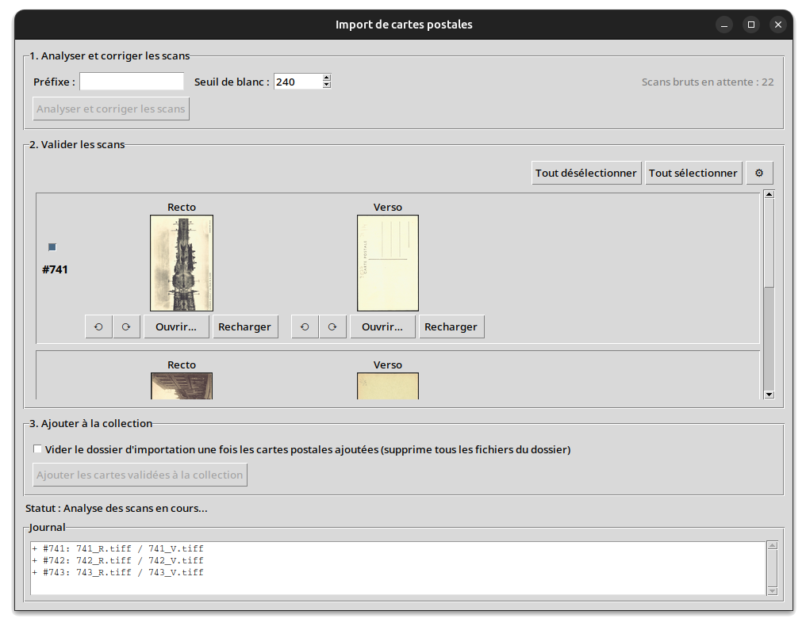

### 2.2 Step 2 — Validate scans

Each prepared card is shown with both of its sides (**Recto** /
**Verso**) as thumbnails. For each card you can:

- Check/uncheck the card to validate (**Select all** / **Select none**);
- Open the image full-size in the built-in viewer (zoom, fit to window,
  actual size, rotation in 90° steps);
- Open the image in your **preferred image editor** (`Open…`, `Reload`
  after an external edit) for more thorough retouching.

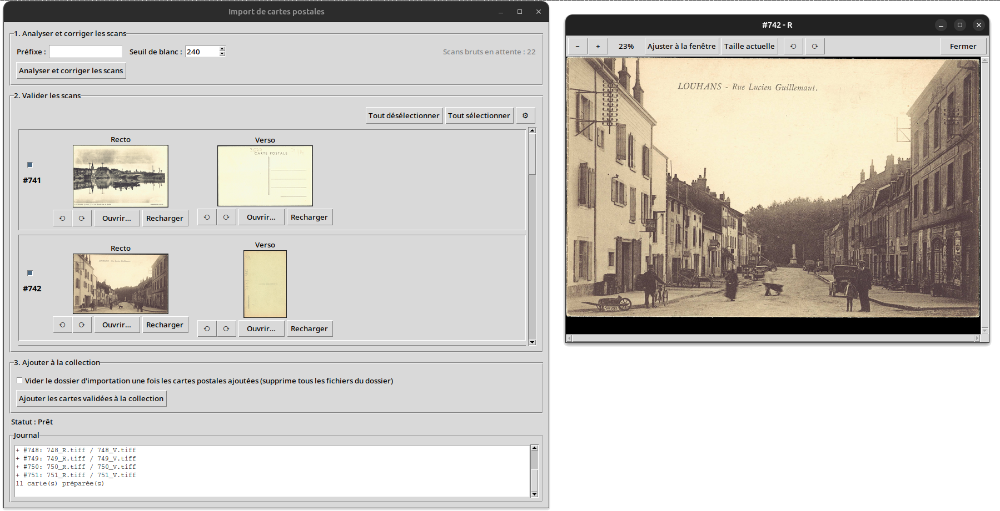

The gear/preferences menu button lets you choose your **preferred
application** for image editing, or use the system's default application.

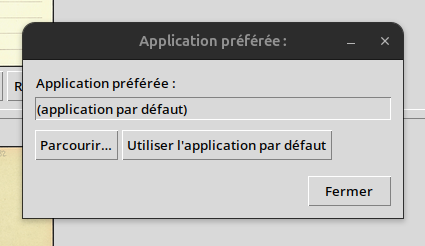

### 2.3 Step 3 — Add to collection

Once the cards are validated:

- **Add validated postcards to collection** button: adds the checked
  cards to the collection managed by `ktmanager` (with automatic
  front/back OCR along the way);
- **Empty the import folder once postcards are added (deletes every file
  in the folder)** checkbox: deletes all files from the import folder
  after adding.

A **Log** and a status bar show progress and the result ("*N postcard(s)
prepared*", "*Import folder emptied*"…).

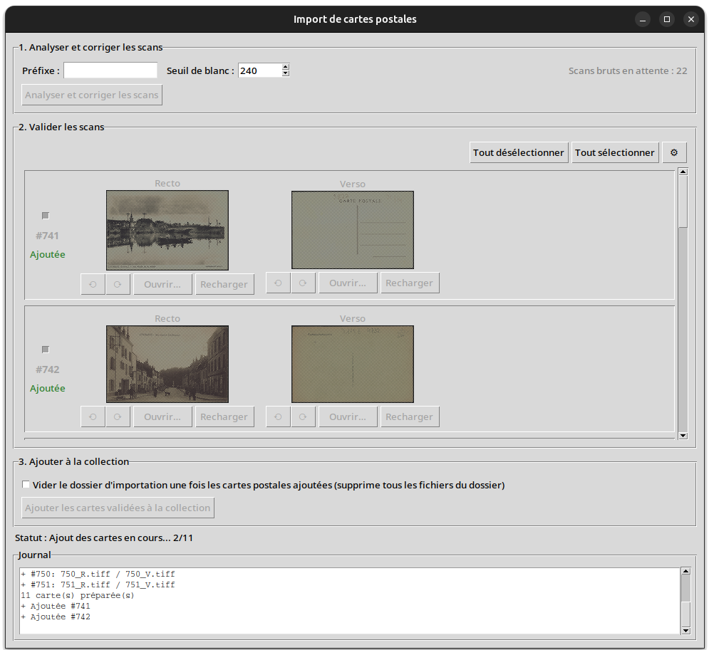

---

## 3. ktmanager — Managing your postcards

`ktmanager` is the central application for managing the collection:
detailed record for each card, search, management of points of interest,
routes, user accounts, the gallery, and publishing the site.

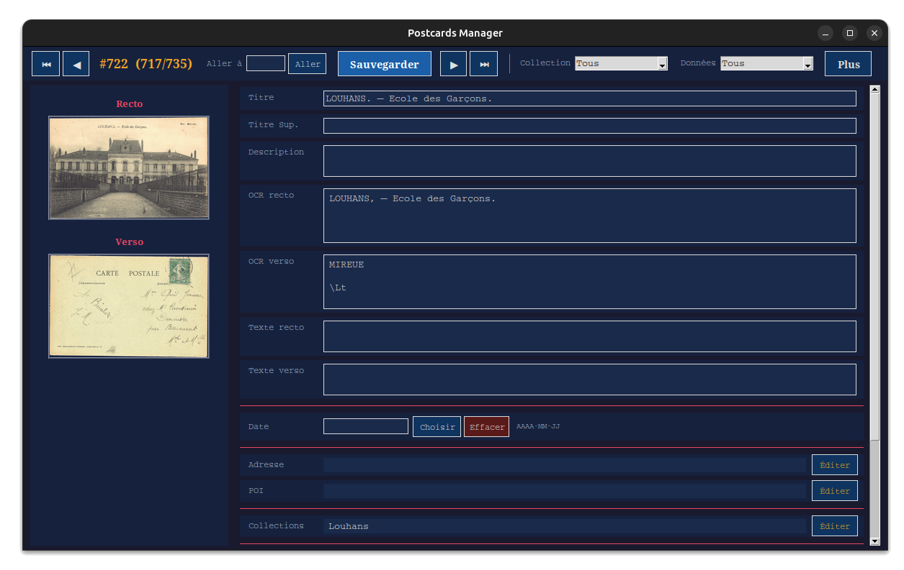

### 3.1 A postcard's record

For each card, the main window displays:

- The **front/back thumbnails** (click to enlarge in a viewer with zoom);
- Editable fields: **Title**, **Extra title**, **Description**,
  **Front/back OCR** (automatically recognized text), **Front/back text**
  (manual transcription), **Address**, **POI** (associated point of
  interest), **Date** (dedicated date picker);
- **Collections**: list of the collections the card belongs to (editable
  via a dedicated window);
- **Doubles**: cards identified as duplicates of this one;
- **GPS**: geolocation coordinates, with quick pasting (formats `lat/lon`,
  `lat,lon`, `lat;lon`, `lat lon`), an **Open OSM ↗** link to
  OpenStreetMap, and a button to copy the link;
- **Updates**: suggested changes received from the public site (see the
  Access section), which can be applied to the GPS field or deleted.

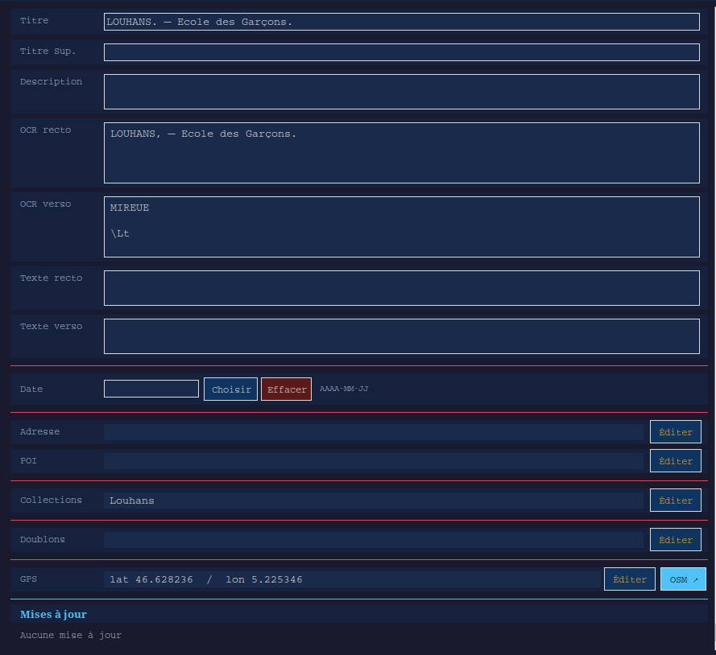

Each section has an **Edit** button that opens a dedicated editor (an
editable list with add, update, Move Up/Move Down reordering and delete).

### 3.2 Navigating the collection

At the top of the window:

- **Go to** a specific card ID (field + **Go** button);
- **Previous** / **Next** to browse cards one at a time;
- Filter by **Collection**;
- Filter by **Missing data**: No GPS, No POI, With updates;
- **Save**: saves the changes to the current record.

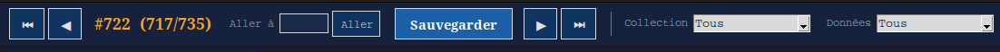

A message "*Card #N has unsaved changes*" appears if you leave a record
without saving.

### 3.3 The "More" menu

The **More** menu gives access to advanced functions:

| Menu entry | Function |
|---|---|
| Search | Search for similar cards by image (via an image URL) |
| Text search | Search titles, descriptions and OCR text |
| Doubles | Automatic search for duplicates in the collection |
| POIs | Manage points of interest |
| Access | Manage public-site user accounts |
| Routes | Manage mapped routes |
| Gallery | Mosaic view of the collection |
| Settings | General collection settings |

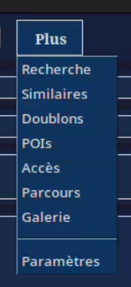

#### Similarity search

Lets you search for cards visually close to a given image via its URL,
with a similarity **threshold** and a maximum number of results. Results
open directly on the matching card's record.

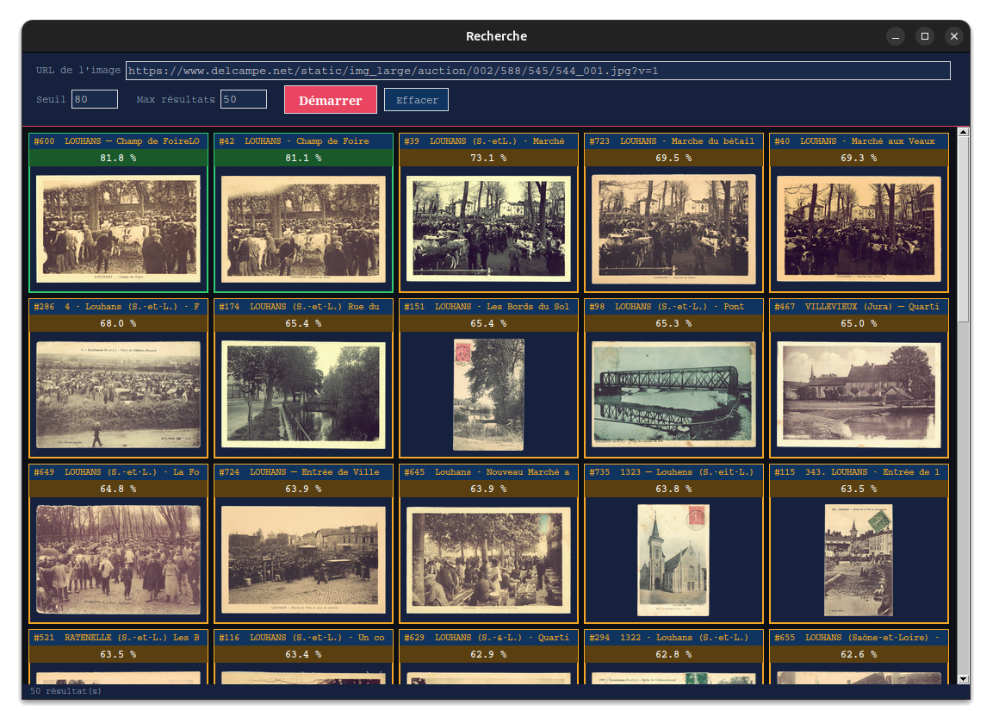

#### Text search

Free-text search across cards (title, description, OCR), filterable by
collection and optionally including duplicates.

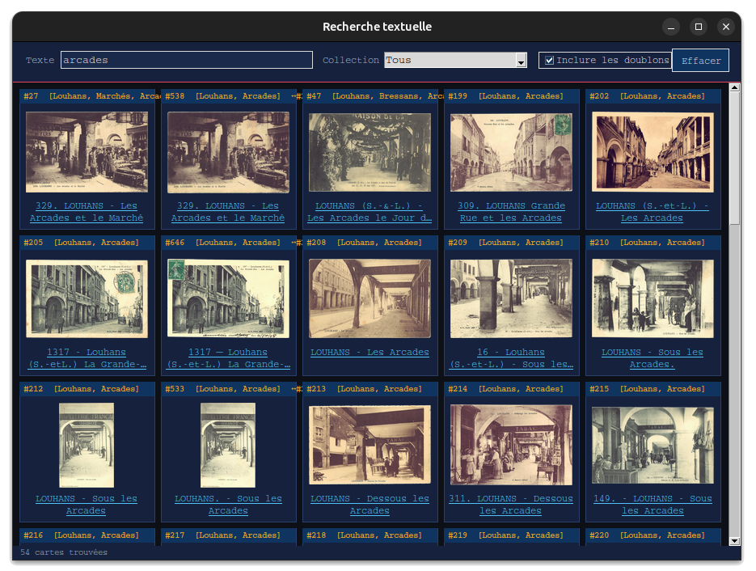

#### Duplicate search

Scans the entire collection to automatically detect visual duplicates,
with an adjustable threshold; each detected duplicate can be edited
directly from the results.

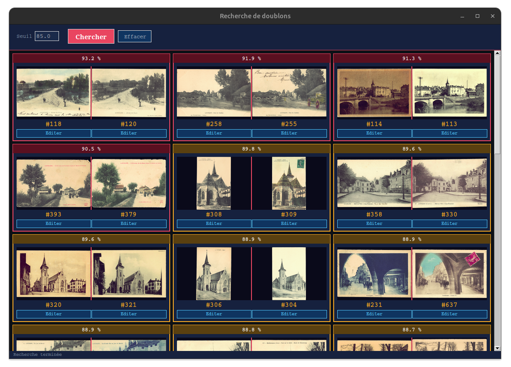

#### Managing POIs (points of interest)

List of points of interest with creation, editing (identifier,
description) and deletion.

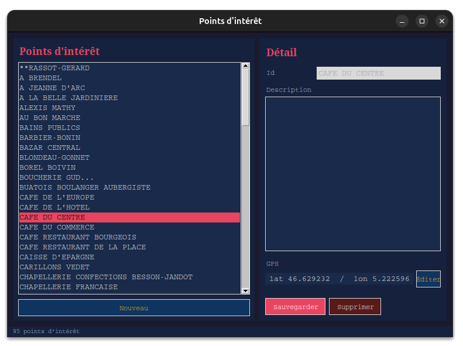

#### Managing access

List of user accounts (email, password) that can access the published
site, with creation, editing and deletion.

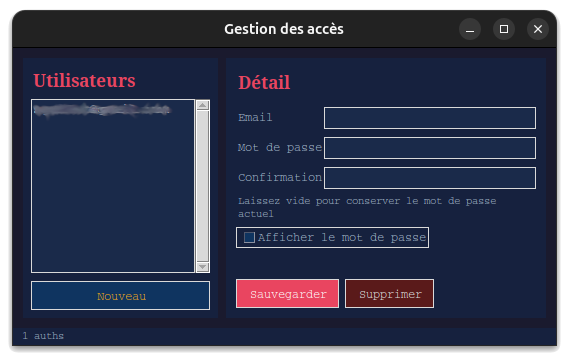

#### Managing routes

List of mapped routes (identifier, label, related collections, starting
point), with creation, editing and deletion.

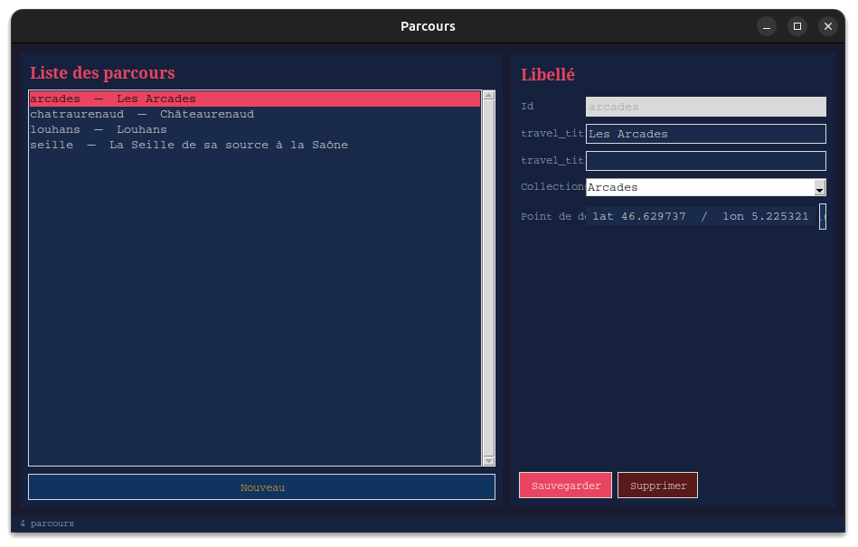

#### Gallery

Mosaic view of the whole collection (Front / Back / Front-Back mode,
adjustable number of columns), with a click to enlarge a card.

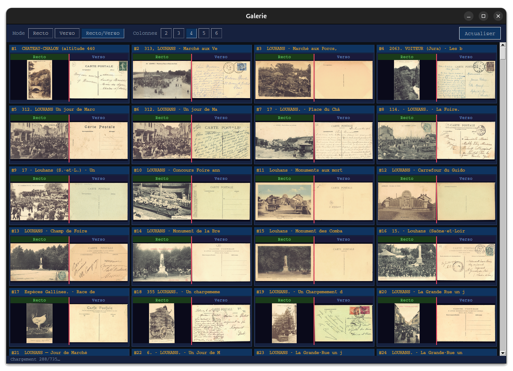

#### Settings

General settings: format of scanned images, collections shown on the
public map. A message reminds you that some settings (image format, map
collections) only take effect the next time the other tools are launched.

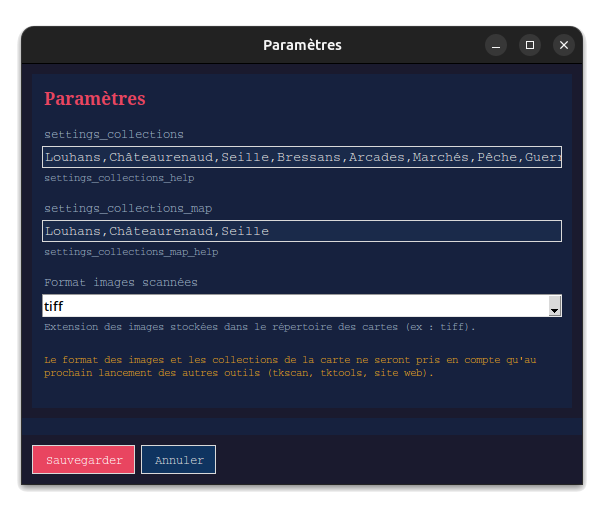

### 3.4 Publishing

The **Publish** button opens a confirmation dialog (with an option to
update routes and other derived data before sending), then shows the
progress of the upload to the public site (with details that can be
shown/hidden), and finally a success or error message.

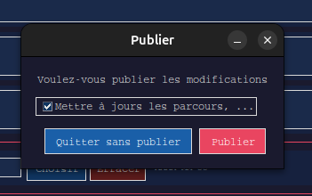

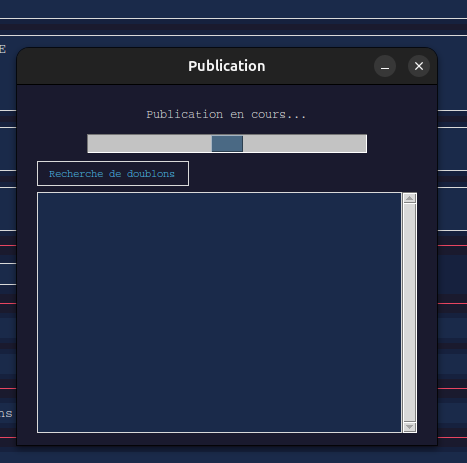

---

## 4. kttools — Toolbox

`kttools` is a set of command-line commands for maintenance operations and
batch processing on the collection. Unlike `ktscan`, `ktimport` and
`ktmanager`, there is no graphical interface: each command is run in a
terminal.

> 💡 All commands accept the following common options, to be placed
> **before** the command name:
>
> ```
> kttools [--conffile FILE] [--datadir DIR] [--importdir DIR] [--tmpdir DIR] [--debug/--no-debug] COMMAND ...
> ```
>
> - `--conffile`: configuration file (default `postcards.conf`)
> - `--datadir`: directory for storing images and JSON files
> - `--importdir`: import directory for scanned images
> - `--tmpdir`: temporary directory
> - `--debug/--no-debug`: enable/disable debug mode

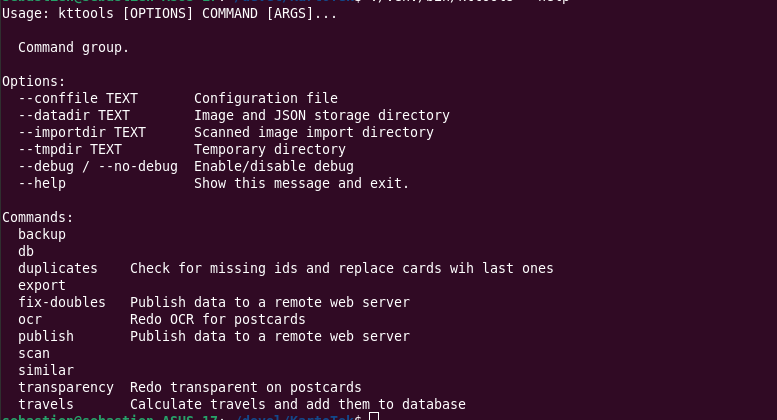

### 4.1 Export

```
kttools export
```
Exports the postcards in the collection to PNG format.

### 4.2 Database (`db`)

```
kttools db generate     # Generates the database from the JSON records
kttools db sync         # Syncs the database with the JSON records
kttools db delete <ID>  # Deletes a card: its database entry, its JSON record and its images
```
Deletion requires confirmation before it is carried out.

### 4.3 Scan (`scan`)

These subcommands are used internally by `ktimport`, but can also be run
manually:

```
kttools scan prepare [--prefix PREFIX] [--white-threshold THRESHOLD]
```
Analyzes and corrects the raw scans in the import directory (equivalent
to step 1 of `ktimport`).

```
kttools scan add <ID> [ID2 ID3 ...] [--ocr-langs fra|fra+eng|...]
```
Adds one or more prepared cards to the collection, with text recognition
(OCR) in the specified language (defaults to the one configured in
`postcards.conf`, section `[tkimport]`).

### 4.4 Backup (`backup`)

```
kttools backup create [--level LEVEL] [--archive NAME]
```
Creates a compressed archive (`.tar.zst`) of the collection directory
(default name: `backup_<date>.tar.zst`, default compression level 15).

```
kttools backup extract --dest DIRECTORY [--archive NAME]
```
Restores a backup archive to the specified directory.

### 4.5 Similarity search (`similar`)

```
kttools similar index
```
(Re)builds the visual similarity index for the whole collection (file
`postcards.pkl`), needed for the searches below as well as for
similarity search in `ktmanager`.

```
kttools similar files [--query-dir DIR] [--threshold THRESHOLD] [--max-results N]
```
For each image in a directory, searches for similar cards in the
collection.

```
kttools similar url --url URL [--threshold THRESHOLD] [--max-results N]
```
Searches for cards similar to an image accessible via URL.

```
kttools similar clipboard [--threshold THRESHOLD] [--max-results N]
```
Searches for cards similar to the image currently on the clipboard.

### 4.6 Duplicates

```
kttools duplicates [--threshold THRESHOLD] [--max-results N]
```
Searches for potential duplicates in the similarity index and also shows
missing duplicates (non-reciprocal relationships between two cards
already marked as duplicates).

```
kttools fix-doubles [--dryrun/--no-dryrun]
```
Fixes non-reciprocal duplicate relationships between cards (if card A
references B as a duplicate, B must also reference A). Runs in simulation
mode (`--dryrun`) by default: shows the fixes without applying them.

### 4.7 OCR and transparency

```
kttools ocr <ID> [ID2 ...] [--ocr-langs fra|fra+eng|...]
```
Re-runs text recognition (OCR) on the front and back of the specified
cards.

```
kttools transparency <ID> [ID2 ...] [--white-threshold THRESHOLD]
```
Redoes the background transparency processing (white background made
transparent) on the images of the specified cards.

### 4.8 Routes

```
kttools travels
```
Calculates the mapped routes defined for the collection and updates the
database.

### 4.9 Publishing

```
kttools publish [CONFIG] [--full]
```
Publishes data to the remote web server, using the configuration named
`CONFIG` (default `sync_default`, a section of the configuration file).
The `--full` option forces all derived data (routes, etc.) to be updated
before publishing — equivalent to the option offered in `ktmanager`'s
publish confirmation dialog.

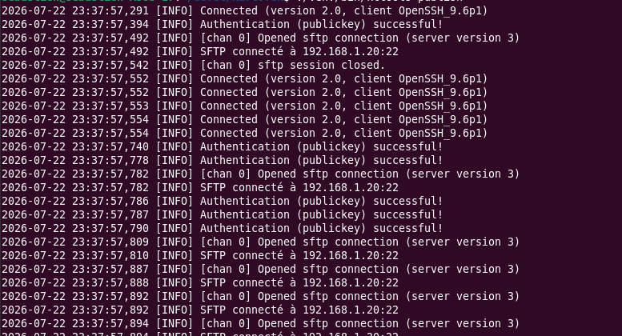

---

*Documentation generated for KartoTek (pypostcards) — to be updated with each significant change to the interface.*
