# Guide de l'utilisateur de KartoTek

KartoTek est une suite d'outils pour numériser, importer, gérer et publier une
collection de cartes postales. Elle se compose de quatre programmes,
utilisés dans cet ordre au fil du travail :

| Outil | Rôle |
|---|---|
| **ktscan** | Numériser des cartes postales (recto/verso) avec un scanner |
| **ktimport** | Contrôler, corriger et importer les scans dans la collection |
| **ktmanager** | Gérer, enrichir et publier la collection de cartes postales |
| **kttools** | Boîte à outils en ligne de commande (maintenance, traitements par lot) |

> 📸 Chaque section indique où insérer une capture d'écran (balises ``).
> La liste complète des captures à réaliser se trouve en fin de document.

Tous les outils graphiques partagent le même fichier de configuration
(`postcards.conf`) et les mêmes répertoires :

- **datadir** : répertoire où sont stockées les images et les fiches JSON de la collection
- **importdir** : répertoire d'attente des scans avant leur import
- **tmpdir** : répertoire temporaire

---

## Sommaire

1. [ktscan — Numériser des cartes postales](#1-ktscan--numériser-des-cartes-postales)
2. [ktimport — Importer des cartes postales](#2-ktimport--importer-des-cartes-postales)
3. [ktmanager — Gérer vos cartes postales](#3-ktmanager--gérer-vos-cartes-postales)
4. [kttools — Boîte à outils](#4-kttools--boîte-à-outils)
5. [Liste des captures d'écran à réaliser](#5-liste-des-captures-décran-à-réaliser)

---

## 1. ktscan — Numériser des cartes postales

`ktscan` est l'application de numérisation par lot. Elle pilote un scanner
(SANE sous Linux, WIA/TWAIN sous Windows) pour numériser vos cartes postales
recto et verso, avec un mode « lot » qui déclenche une numérisation à
intervalle régulier (le temps de retourner la carte suivante sur la vitre du
scanner).

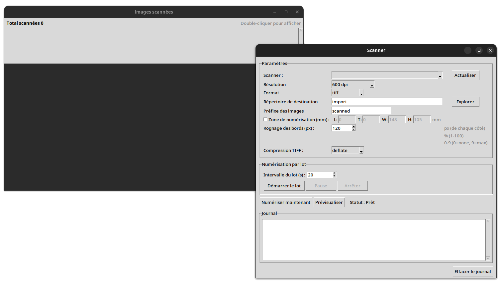

### 1.1 Démarrage

Au lancement, si le répertoire d'import (`importdir`) contient déjà des
fichiers, une fenêtre s'affiche pour vous proposer de :

- **Supprimer les fichiers et continuer** ;
- **Continuer et ajouter les fichiers** (les nouveaux scans viendront s'ajouter) ;
- **Quitter**.

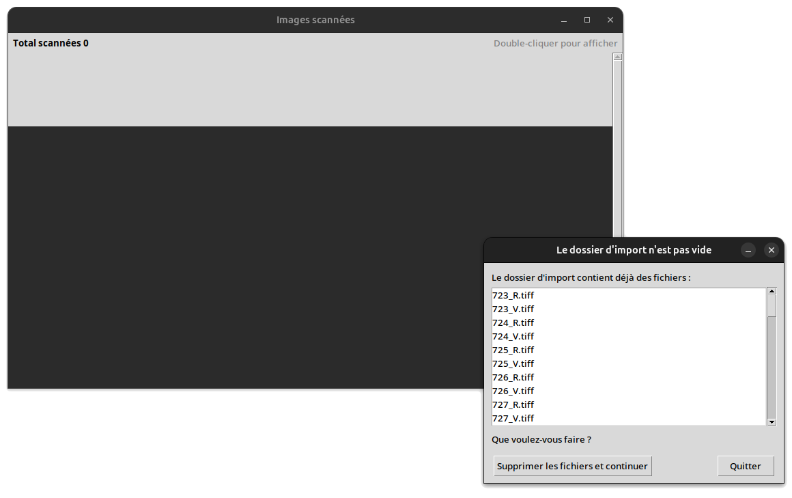

### 1.2 Paramètres de numérisation

Le panneau **Paramètres** permet de régler :

- **Scanner** : le scanner sélectionné parmi ceux détectés (bouton **Actualiser** pour relancer la détection) ;
- **Résolution** : 150 / 300 / 600 / 1200 dpi ;
- **Format** : tiff, png ou jpeg ;
- **Répertoire de destination** (bouton **Explorer**) ;
- **Préfixe des images** : préfixe ajouté au nom des fichiers scannés ;
- **Zone de numérisation (mm)** : coordonnées et dimensions de la zone à numériser (utile pour ne scanner que le format carte postale) ;
- **Rognage des bords (px)** : nombre de pixels à retirer sur chaque côté après la numérisation ;
- **Qualité JPEG**, **Compression PNG**, **Compression TIFF** : réglages de compression selon le format choisi.

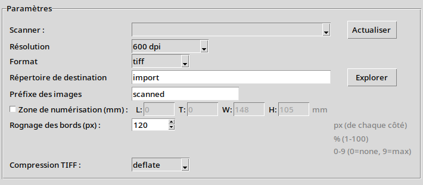

### 1.3 Numérisation par lot

Le panneau **Numérisation par lot** permet de définir un **intervalle** (en
secondes) entre deux numérisations automatiques, puis de :

- **Démarrer le lot** : lance la numérisation en boucle. Le bouton devient
  « Numériser maintenant » pendant le compte à rebours, pour scanner
  immédiatement sans attendre la fin de l'intervalle ;
- **Pause** / **Reprendre** : suspend ou relance le compte à rebours ;
- **Arrêter** : stoppe le lot.

Le bouton **Prévisualiser** permet de lancer une numérisation d'essai
affichée dans une fenêtre séparée, sans rien enregistrer sur le disque.


Un journal (**Log**) en bas de la fenêtre trace chaque action (numérisation,
erreurs, pauses…), avec un bouton **Effacer le journal**.

### 1.4 Fenêtre des images scannées

Une fenêtre séparée « **Images scannées** » affiche les miniatures de toutes
les cartes numérisées pendant la session, avec le nombre total scanné et un
double-clic pour agrandir une image.


> ℹ️ Si aucun scanner n'est détecté, ktscan peut fonctionner en mode simulé
> (image de test générée), pratique pour se former sans matériel.

---

## 2. ktimport — Importer des cartes postales

`ktimport` est l'étape intermédiaire entre `ktscan` et `ktmanager` : elle
sert à contrôler, corriger et valider les scans avant de les intégrer
définitivement à la collection. Le travail se déroule en trois étapes,
affichées les unes sous les autres dans la fenêtre.


### 2.1 Étape 1 — Analyser et corriger les scans

Cette étape traite les scans bruts présents dans le répertoire d'import :

- **Préfixe** : filtre les fichiers à traiter par préfixe ;
- **Seuil de blanc** : seuil utilisé pour détecter et corriger l'arrière-plan des scans ;
- Bouton **Analyser et corriger les scans** : lance le traitement (nombre de
  scans en attente affiché : « Scans bruts en attente : N »).


### 2.2 Étape 2 — Valider les scans

Chaque carte préparée est présentée avec ses deux faces (**Recto** /
**Verso**) sous forme de vignette. Pour chaque carte, vous pouvez :

- Cocher/décocher la carte à valider (**Tout sélectionner** / **Tout désélectionner**) ;
- Ouvrir l'image en grand dans la visionneuse intégrée (zoom, ajustement à
  la fenêtre, taille réelle, rotation par pas de 90°) ;
- Ouvrir l'image dans votre **éditeur d'image préféré** (`Ouvrir…`,
  `Recharger` après modification externe) pour une retouche plus poussée.


Le bouton d'engrenage/menu de préférences permet de choisir votre
**application préférée** pour l'édition d'image, ou d'utiliser
l'application par défaut du système.


### 2.3 Étape 3 — Ajouter à la collection

Une fois les cartes validées :

- Bouton **Ajouter les cartes validées à la collection** : intègre les
  cartes cochées dans la collection gérée par `ktmanager` (OCR automatique
  du recto/verso au passage) ;
- Case à cocher **Vider le dossier d'importation une fois les cartes
  postales ajoutées** : supprime tous les fichiers du dossier d'import après
  l'ajout.

Un journal (**Log**) et une barre de statut affichent la progression et le
résultat (« *N carte(s) préparée(s)* », « *Le dossier d'import a été vidé* »…).


---

## 3. ktmanager — Gérer vos cartes postales

`ktmanager` est l'application centrale de gestion de la collection : fiche
détaillée de chaque carte, recherche, gestion des points d'intérêt, des
parcours, des accès utilisateurs, de la galerie et publication du site.

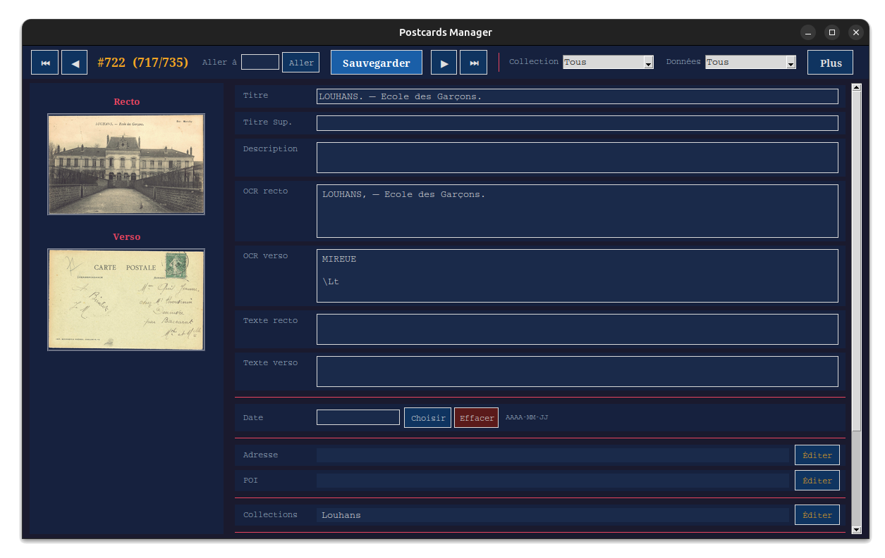

### 3.1 Fiche d'une carte postale

Pour chaque carte, la fenêtre principale affiche :

- Les **vignettes recto/verso** (clic pour agrandir dans une visionneuse
  avec zoom) ;
- Les champs éditables : **Titre**, **Titre sup.**, **Description**,
  **OCR recto/verso** (texte reconnu automatiquement), **Texte recto/verso**
  (transcription manuelle), **Adresse**, **POI** (point d'intérêt associé),
  **Date** (sélecteur de date dédié) ;
- **Collections** : liste des collections auxquelles appartient la carte
  (éditable via une fenêtre dédiée) ;
- **Doublons** : cartes identifiées comme doublons de celle-ci ;
- **GPS** : coordonnées de géolocalisation, avec collage rapide (formats
  `lat/lon`, `lat,lon`, `lat;lon`, `lat lon`), lien **Ouvrir OSM ↗** vers
  OpenStreetMap et bouton pour copier le lien ;
- **Mises à jour** : suggestions de modifications reçues depuis le site
  public (voir § Accès), que l'on peut appliquer au GPS ou supprimer.

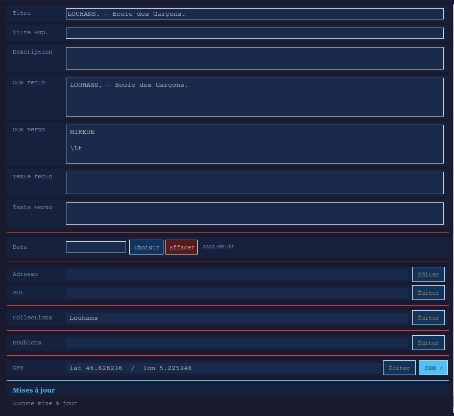

Chaque section dispose d'un bouton **Éditer** ouvrant un éditeur dédié
(liste éditable avec ajout, mise à jour, réorganisation Monter/Descendre et
suppression).

### 3.2 Navigation dans la collection

En haut de la fenêtre :

- **Aller à** un identifiant de carte précis (champ + bouton **Aller**) ;
- **Précédent** / **Suivant** pour parcourir les cartes une à une ;
- Filtre par **Collection** ;
- Filtre par **Données manquantes** : Sans GPS, Sans POI, Avec mises à jour ;
- **Sauvegarder** : enregistre les modifications de la fiche en cours.

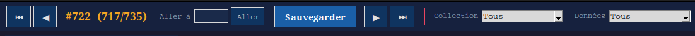

Un message « *La carte #N a des modifications non sauvegardées* » s'affiche
si vous quittez une fiche sans enregistrer.

### 3.3 Menu « Plus »

Le menu **Plus** donne accès aux fonctions avancées :

| Entrée du menu | Fonction |
|---|---|
| Recherche | Recherche de cartes similaires par image (via une URL d'image) |
| Recherche textuelle | Recherche dans les titres, descriptions et textes OCR |
| Doublons | Recherche automatique de doublons dans la collection |
| POIs | Gestion des points d'intérêt |
| Accès | Gestion des comptes utilisateurs du site public |
| Parcours | Gestion des parcours cartographiques |
| Galerie | Vue en mosaïque de la collection |
| Paramètres | Réglages généraux de la collection |

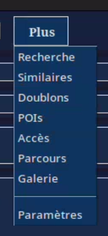

#### Recherche par similarité

Permet de rechercher les cartes visuellement proches d'une image donnée par
son URL, avec un **seuil** de similarité et un nombre maximal de résultats.
Les résultats s'ouvrent directement sur la fiche de la carte correspondante.

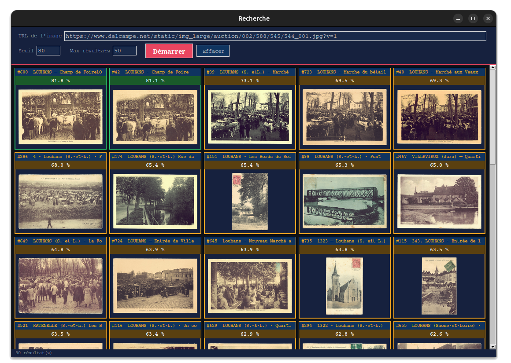

#### Recherche textuelle

Recherche en texte libre dans les cartes (titre, description, OCR),
filtrable par collection et incluant en option les doublons.

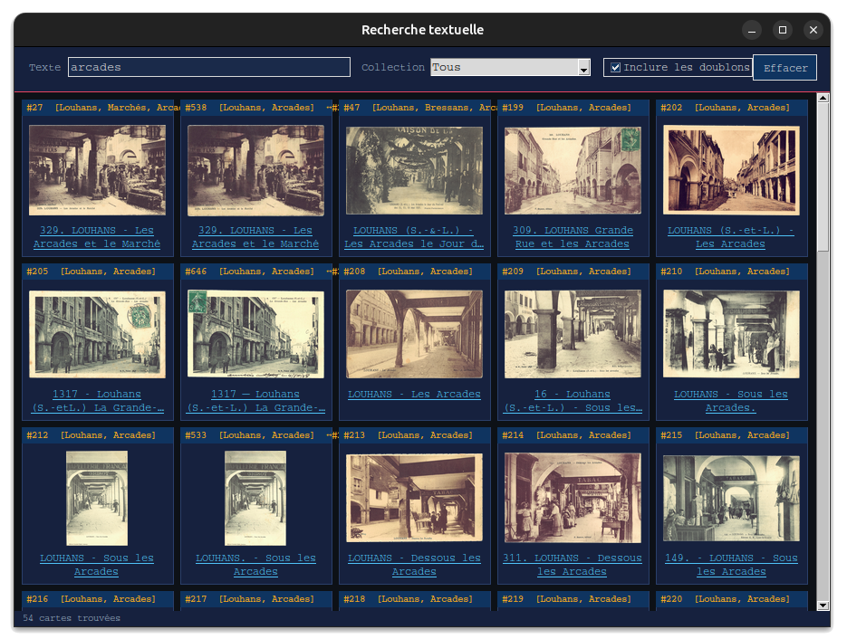

#### Recherche de doublons

Analyse l'ensemble de la collection pour détecter automatiquement les
doublons visuels, avec un seuil réglable ; chaque doublon détecté peut être
édité directement depuis les résultats.

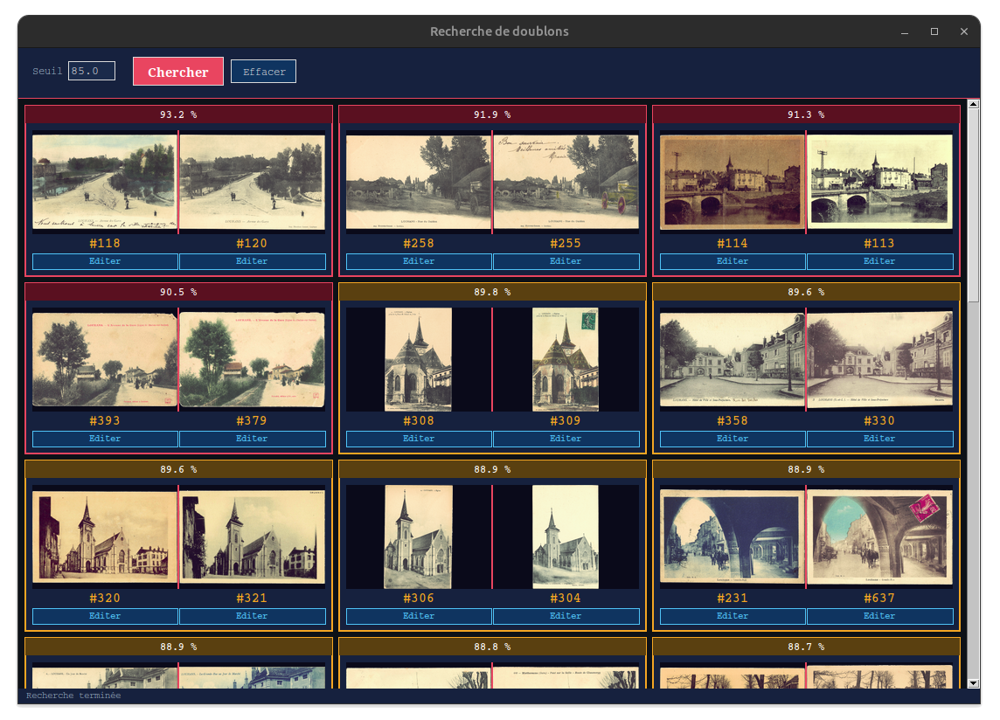

#### Gestion des POIs (points d'intérêt)

Liste des points d'intérêt avec création, édition (identifiant, description)
et suppression.

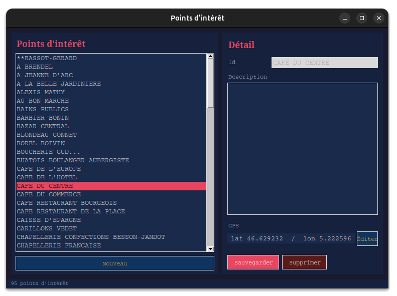

#### Gestion des accès

Liste des comptes utilisateurs (email, mot de passe) pouvant accéder au site
publié, avec création, modification et suppression.

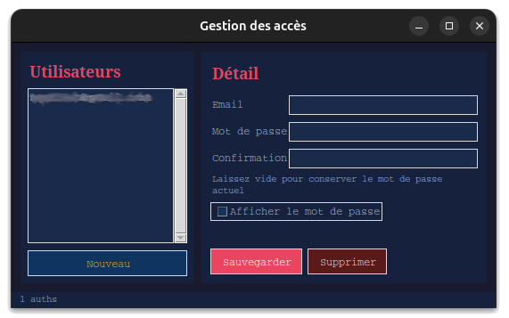

#### Gestion des parcours

Liste des parcours cartographiques (identifiant, libellé, collections
concernées, point de départ), avec création, édition et suppression.

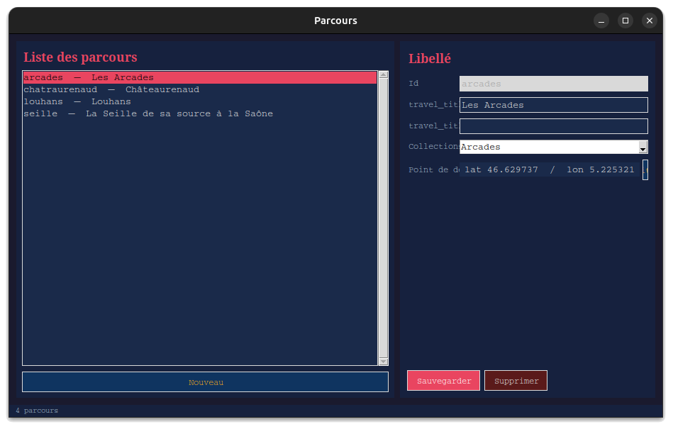

#### Galerie

Vue en mosaïque de toute la collection (mode Recto / Verso / Recto-Verso,
nombre de colonnes réglable), avec un clic pour agrandir une carte.

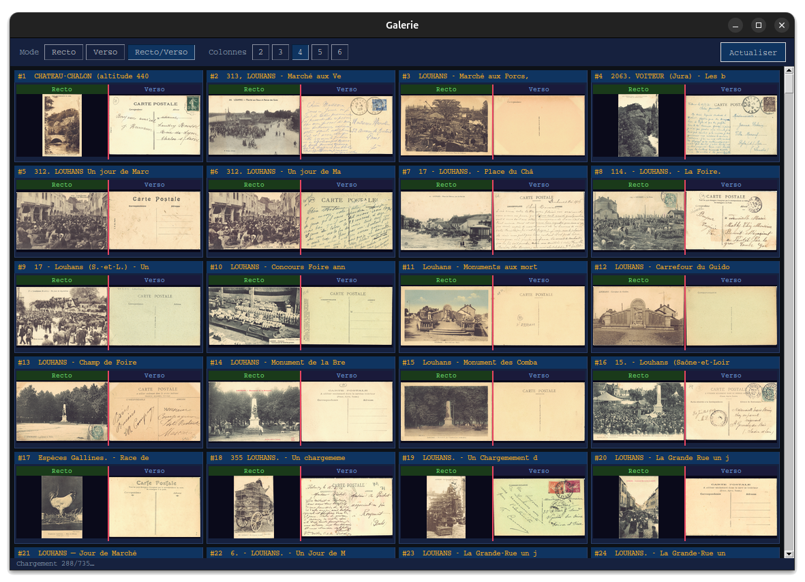

#### Paramètres

Réglages généraux : format des images scannées, collections affichées sur
la carte publique. Un message rappelle que certains réglages (format
d'image, collections de la carte) ne sont pris en compte qu'au prochain
lancement des autres outils.

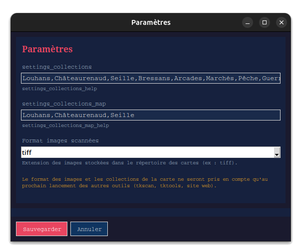

### 3.4 Publication

Le bouton **Publier** ouvre une boîte de dialogue de confirmation (avec une
option pour mettre à jour les parcours et autres données dérivées avant
l'envoi), puis affiche la progression de l'envoi vers le site public
(avec un détail affichable/masquable), et enfin un message de succès ou
d'erreur.

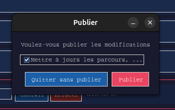

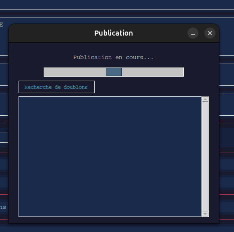

---

## 4. kttools — Boîte à outils

`kttools` est un ensemble de commandes en ligne de commande destinées aux
opérations de maintenance et aux traitements par lot sur la collection.
Contrairement à `ktscan`, `ktimport` et `ktmanager`, il n'y a pas
d'interface graphique : chaque commande se lance dans un terminal.

> 💡 Toutes les commandes acceptent les options communes suivantes, à
> placer **avant** le nom de la commande :
>
> ```
> kttools [--conffile FICHIER] [--datadir REP] [--importdir REP] [--tmpdir REP] [--debug/--no-debug] COMMANDE ...
> ```
>
> - `--conffile` : fichier de configuration (par défaut `postcards.conf`)
> - `--datadir` : répertoire de stockage des images et des JSON
> - `--importdir` : répertoire d'import des images numérisées
> - `--tmpdir` : répertoire temporaire
> - `--debug/--no-debug` : active/désactive le mode debug

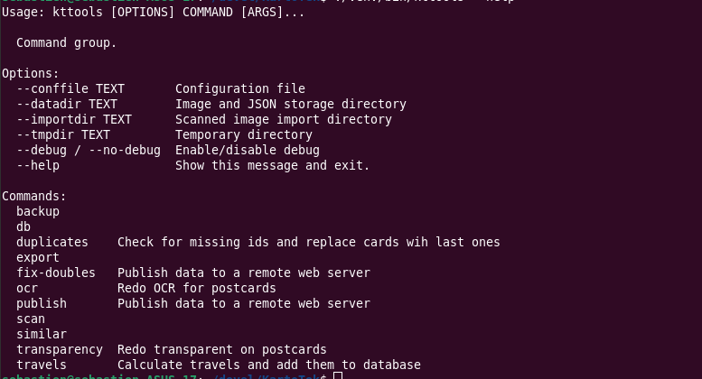

### 4.1 Export

```
kttools export
```
Exporte les cartes postales de la collection au format PNG.

### 4.2 Base de données (`db`)

```
kttools db generate     # Génère la base de données à partir des fiches JSON
kttools db sync         # Synchronise la base de données avec les fiches JSON
kttools db delete <ID>  # Supprime une carte : sa base, sa fiche JSON et ses images
```
La suppression demande une confirmation avant d'être exécutée.

### 4.3 Scan (`scan`)

Ces sous-commandes sont utilisées en interne par `ktimport`, mais peuvent
aussi être lancées manuellement :

```
kttools scan prepare [--prefix PREFIXE] [--white-threshold SEUIL]
```
Analyse et corrige les scans bruts du répertoire d'import (équivalent de
l'étape 1 de `ktimport`).

```
kttools scan add <ID> [ID2 ID3 ...] [--ocr-langs fra|fra+eng|...]
```
Ajoute une ou plusieurs cartes préparées à la collection, avec
reconnaissance de texte (OCR) dans la langue indiquée (par défaut celle
configurée dans `postcards.conf`, section `[tkimport]`).

### 4.4 Sauvegarde (`backup`)

```
kttools backup create [--level NIVEAU] [--archive NOM]
```
Crée une archive compressée (`.tar.zst`) du répertoire de la collection
(nom par défaut : `backup_<date>.tar.zst`, niveau de compression 15 par
défaut).

```
kttools backup extract --dest REPERTOIRE [--archive NOM]
```
Restaure une archive de sauvegarde dans le répertoire indiqué.

### 4.5 Recherche par similarité (`similar`)

```
kttools similar index
```
(Re)construit l'index de similarité visuelle de toute la collection
(fichier `postcards.pkl`), nécessaire pour les recherches ci-dessous ainsi
que pour la recherche par similarité dans `ktmanager`.

```
kttools similar files [--query-dir REP] [--threshold SEUIL] [--max-results N]
```
Recherche, pour chaque image d'un répertoire, les cartes similaires dans la
collection.

```
kttools similar url --url URL [--threshold SEUIL] [--max-results N]
```
Recherche les cartes similaires à une image accessible par URL.

```
kttools similar clipboard [--threshold SEUIL] [--max-results N]
```
Recherche les cartes similaires à l'image actuellement présente dans le
presse-papiers.

### 4.6 Doublons

```
kttools duplicates [--threshold SEUIL] [--max-results N]
```
Recherche les doublons potentiels dans l'index de similarité et affiche
également les doublons manquants (relations non réciproques entre deux
cartes déjà marquées comme doublons).

```
kttools fix-doubles [--dryrun/--no-dryrun]
```
Corrige les relations de doublons non réciproques entre cartes (si la carte
A référence B comme doublon, B doit aussi référencer A). Par défaut en mode
simulation (`--dryrun`) : affiche les corrections sans les appliquer.

### 4.7 OCR et transparence

```
kttools ocr <ID> [ID2 ...] [--ocr-langs fra|fra+eng|...]
```
Relance la reconnaissance de texte (OCR) sur le recto et le verso des cartes
indiquées.

```
kttools transparency <ID> [ID2 ...] [--white-threshold SEUIL]
```
Refait le traitement de transparence de l'arrière-plan (fond blanc rendu
transparent) sur les images des cartes indiquées.

### 4.8 Parcours

```
kttools travels
```
Calcule les parcours cartographiques définis pour la collection et met à
jour la base de données.

### 4.9 Publication

```
kttools publish [CONFIG] [--full]
```
Publie les données vers le serveur web distant, en utilisant la
configuration nommée `CONFIG` (par défaut `sync_default`, section du
fichier de configuration). L'option `--full` force la mise à jour de
toutes les données dérivées (parcours, etc.) avant la publication —
équivalent de l'option proposée dans la boîte de dialogue de publication de
`ktmanager`.

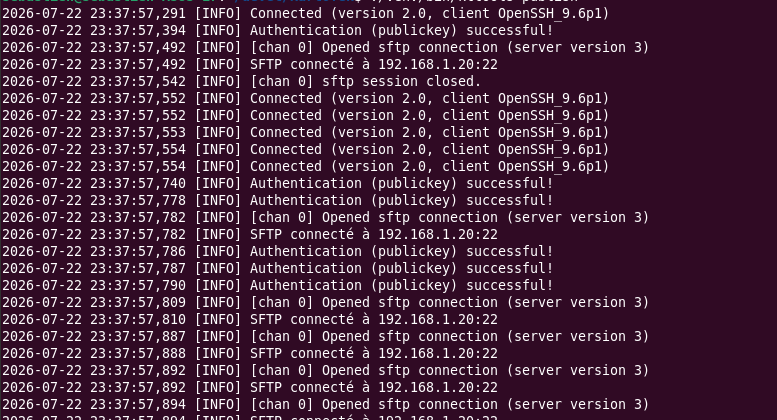

---

## 5. Liste des captures d'écran à réaliser

Voici la liste complète des captures d'écran référencées dans ce document,
à réaliser puis à déposer dans un dossier `images/` à côté de ce fichier
(les noms de fichiers correspondent exactement à ceux utilisés dans les
balises `` ci-dessus) :

### ktscan
4. `ktscan-lot-en-cours.png` — Numérisation par lot en cours, avec le compte à rebours
5. `ktscan-images-scannees.png` — Fenêtre « Images scannées » avec ses miniatures

### ktimport
6. `ktimport-fenetre-principale.png` — Fenêtre principale avec les 3 étapes visibles
7. `ktimport-etape1-analyse.png` — Étape 1 : Analyser et corriger les scans
8. `ktimport-etape2-validation.png` — Étape 2 : grille de vignettes recto/verso + visionneuse ouverte
9. `ktimport-editeur-image-preferences.png` — Fenêtre de choix de l'éditeur d'image préféré
10. `ktimport-etape3-ajout.png` — Étape 3 : ajout à la collection avec l'option « vider le dossier d'import »

---

*Documentation générée pour KartoTek (pypostcards) — à mettre à jour à chaque évolution notable de l'interface.*
